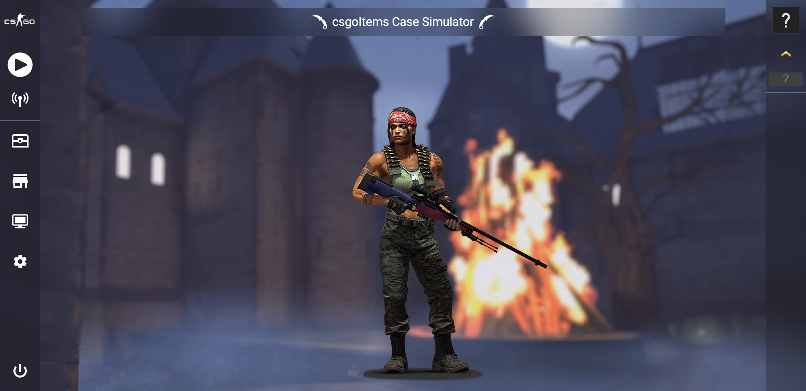
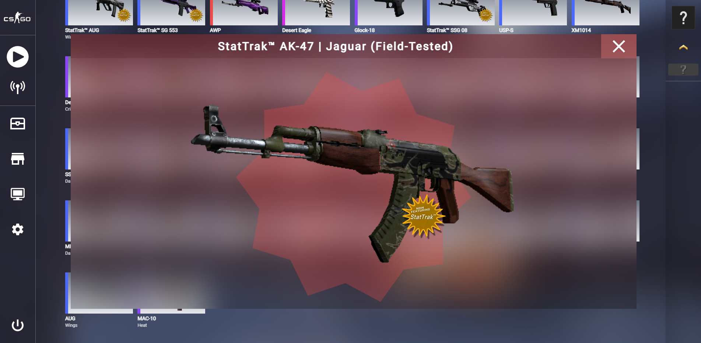
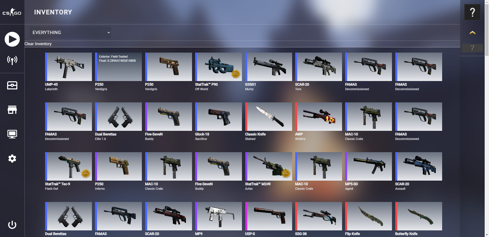
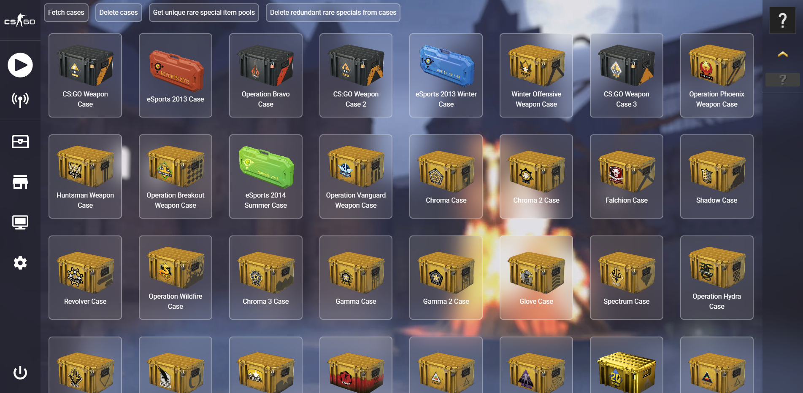

# Nebula

  <h3 align="center">CSGO Case Simulator</h3>
  

    Save money and simulate your case openings
     
    <a href="https://github.com/schuler-ph/csgoSkins/issues">Report a bug or request a feature</a>
  

## Description

A simple recreation of the inventory and case features from the game Counter Strike: Global Offensive.
The UI represents the current (August 2023) version of the Panorama UI from the official game.
In the application you can open any skin case and inspect the received item in your inventory.

## Screenshots and demonstration

